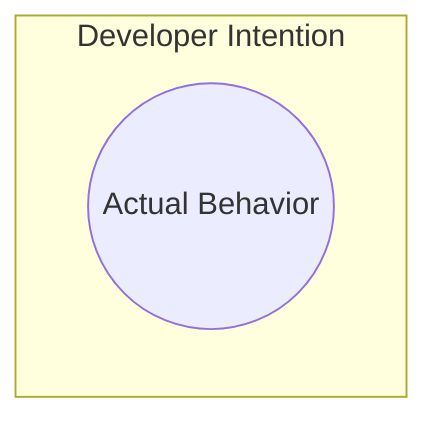
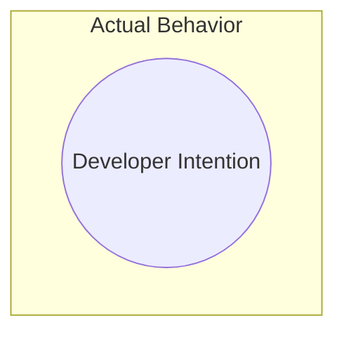

> Disclaimer: Of course the boring part of writing this was helped by AI. But the insights and guided prompts are mine. I do believe this can benefit the community.

## Introduction

Smart contract auditing is often described as finding bugs in code (after all, a bug report is the expected output).

But many of you may have already realized this:
> Bugs are rarely just coding errors. They’re broken assumptions. They’re mismatches between the user's *expectations*, what the developer *intended*, and what the code *actually does*.

It’s been shown time and time again: checklist-driven reviews are never enough. All top auditors eventually drop them. Instead, to uncover critical vulnerabilities and truly understand the code, they shift—consciously or not—toward a **spec thinking** mindset. One where checklists are made on the fly, born from uncovering assumptions and implicit rules.

This article introduces a minimalist but powerful framework I came up with, resulting from my years of work with Certora: **The Three Prompts of Spec Thinking**. It's a way to analyze code through a threat modeling lens. I hope it'll serve you well!

---

## What's even a Smart Contract, from First Principles?

An **asset management system**, where **actors** interact to gain specific **benefits** through **actions**.

### What's an ASSET?

Money, Power or Ownership given to a user.

👉 Try this cue: *"If it's something that can be transferred, it's an asset."*.

### What's an ACTOR?

An interactooor with a smart contract:

- Other protocols (dependencies)
- Other users (permissioned or not)
- Yourself (as an attacker, alt account, or regular user)
- The protocol itself (`address(this)`)

👉 Try this cue: *If it can be identified by an `address`, it’s an actor.*

### What are ACTIONS?

An **action** is when an actor initiates interaction with the system. This triggers some logic that takes in:

- Input parameters
- State variables
- External dependencies

…and produces:

- State changes (on the Smart Contract itself or on external dependencies, like balances)
- Returned Values
- Either a success or a revert

The flow may span multiple steps, touch multiple assets, or impact multiple actors.

🔗 I recommend re-reading my post here: <https://justdravee.github.io/posts/thread-state-machine/>

---

## What's even a Bug, from First Principles?

Bugs fall into **three categories**:

### 1. **Missing Paths**

The user’s expectations aren’t met—because the code doesn’t even support them.
> Example: You can deposit money… but never withdraw. The protocol’s core logic isn’t there.

This reflects a failure in **liveness**: something *good* was supposed to happen, but doesn’t.

### 2. **Incorrect Happy Paths**

The feature exists and runs, but it doesn’t behave correctly. Think of integration mistakes or faulty state transitions.
> Example: A user can still receive rewards after being deleted.

Often caught through unit tests, these are straightforward to spot but easy to miss in complex flows.

### 3. **Unexpected Paths**

The system does *more* than intended. Abusable edge cases, unsafe flows, and poorly scoped permissions emerge here.
> Example: An attacker uses reentrancy to drain funds.

This is where your **threat modeling** kicks in the hardest.

---

## What’s even a Critical Severity Issue, from First Principles?

A critical issue arises when **an asset is compromised**. Here are four key threat categories:

- **Theft** – Unauthorized transfer or drain of user/system assets
- **Lock** – Permanent inaccessibility of funds or system features
- **Free-Riding** – Gaining rewards or access without contributing (e.g., bypassing fees, yield farming without staking)
- **Usurping** – Illegitimately taking over ownership, permissions, or governance

If an attacker can exploit the contract to trigger any of these, you’re likely looking at a critical bug.

---

## What are Properties and Invariants?

### 🛡 Invariants

Statements that must *always* be true, regardless of how the contract is used.
> “The total supply must always equal the sum of all user balances.”

### ✅ Properties (aka Postconditions)

Assertions that should be true *after* a specific function or transition.
> “After withdrawing, the user’s balance should decrease by the withdrawn amount.”

These are your **specs**—they represent how the system is *supposed* to behave.

### Why Do They Matter?

- **Bugs break them**: A false property = something’s wrong.
- They help you reason about intent, not just code (Ever heard of code blindness? Ever heard of re-implementing functionalities your way to compare implementations?).
- They’re easier to brainstorm than full path coverage.
- They work best when written in plain English first.
- I'll say this again, PLAIN ENGLISH IS SEVERELY UNDERRATED. More on that right now.

### 3-Layer Spec Abstraction

1. **High-level spec (Plain English)**: What should users be able to do?
   - “A user cannot lose funds unless they voluntarily withdraw or trade.”
2. **Mid-level spec (State Machine Model):**: What state variables enable that behavior?
   - Track states like `Deposited`, `Locked`, `Withdrawn`.
   - “From `Locked` → `Withdrawn` is only allowed if time has passed.”
3. **Code-level spec**: What are the function-level conditions and transitions?
   - Assert `if state == Locked && now >= unlockTime, then withdraw() allowed`.

🎯 This ladder helps you anchor all logic to something meaningful.

---

## Teachings from Formal Methods

### ✅ **Liveness Properties** = *Design-Level expectations* or “Something good eventually happens.”

It's the **Design intentions** and **Implementation** layer.

They represent **what the system should enable**—they’re about capability, availability, progress.

These align with :

- **What the user expects** to be able to do.
- **What the developer intended** (happy paths).
- **Missing or incorrectly implemented functionality.**

🧠 These map to **Bug Categories 1 & 2**:

1. **Missing functionality** (e.g., can't withdraw, can't claim rewards)  
2. **Incorrect happy paths** (e.g., claims don't subtract balance, refunds miscalculated)

👉 Try this cue: *"Eventually, X must happen."*

### 🛡 **Safety Properties** = *Control-level guarantees* or “Nothing bad happens.”

It's the **Enforcement layer**.

They protect **what should never be allowed**—they’re about bounds, rules, and forbidden states.

These align with **Abusable Behaviors**:

- **Over-permissiveness**
- **Edge cases**
- **Unexpected paths and flows**

These map to **Bug Category 3**:
3. **The system can do more than it should**  
   (e.g., double-claim, free rewards, theft via desync)

This is where most ideas for security-checks can be made. This is also where you can get quite creative in tackling assumptions or inferring behaviors on rare code paths (e.g. downcast overflow etc.).

👉 Try this cue: Start a sentence with *"Should only..."* or *"Should never..."*. Given that assumptions are conditions that are expected to be true, but aren't enforced by code: this here is where the implicit truths can be revealed explicitly, and thus can be checked for hidden bugs

🔁 **Temporal Logic Thinking** = *Sequence/flow correctness*  

A bit between both of the above.

These properties help define when **liveness should occur**, and when **safety must remain true** through transitions.

- Think in terms of: *Before/After/Always/Eventually must be true.*
- Super helpful for flow bugs, sequence errors, and edge states.

---

## The Three Prompts of Spec Thinking

### 1. **What is expected?**

👉 Try this cue: What *should* happen? What is the user *meant* to be able to do?

Finds:

- Missing functionality
- Broken happy paths
- Failed integrations
- Violated liveness properties

🔍 Catches:

- Missing state transitions
- Misimplemented logic
- Incorrect or incomplete user flows

### 2. **What is allowed?**

👉 Try this cue: What can the system be made to do—whether intended or not?

Finds:

- Over-permissive flows
- Missing require statements
- Unsafe edge cases
- Violated safety properties

🔍 Catches:

- Incorrect input handling
- Edge-case abuse
- Reentrancy paths
- Unchecked states and unvalidated assumptions
- Dangerous combinations of state

💡 There's a beautiful post from <https://x.com/0xCharlesWang> about the challenge of uncovering call paths here: <https://x.com/0xCharlesWang/status/1768004932936880273>

### 3. **What was assumed but never enforced?**

👉 Try this cue: What does the code *assume*, but never check?
👉 Answer with "Should only..." or "Eventually, ... must happen"

Finds:

- Implicit invariants
- Precondition gaps (Insufficient bounds for input parameters, state variables, or external dependencies)
- State desynchronization
- Order-dependency bugs

🔍 Catches:

- Invariant violations
- External/internal state mismatches
- Missing guards on critical paths

🧠 This is where your deepest bugs hide—and where your custom “checklist” builds itself naturally.

---

## Sink-Source Thinking: A Strategy for Using the Prompts

> "But ser… path explosion is real!"

Yep. That’s why we need **sink-source thinking**, an old gem samczsun mentioned for prioritizing the effort during audits or bug bounty hunting.

Sinks are the **endpoints** of value movement or critical state transitions. They represent **the things you’re trying to protect**.

These are the moments where:

- Assets can be stolen
- State can be corrupted
- Control can be hijacked
- Trust can be broken

Examples of sinks:

- Funds being transferred out
- A user receives accounting-based rewards
- An address is granted elevated permissions
- Ownership or authority is updated
- Tokens are minted or burned
- Critical system variables are modified

> **If a mistake here causes financial loss, permanent lock, or protocol takeover — it’s a sink.**

Why start with sinks? Because **you don’t have time to look at everything**.  

You don’t need to model the whole contract—you just need to ask:

> *What are the most catastrophic outcomes possible in this system?*

Then you trace **backward**:

- What inputs, state variables, or external calls **influence** that sink?
- What assumptions are made before it’s triggered?
- Are those assumptions **validated** or just **hoped for**?

This turns path explosion into **targeted path tracing**.

#### **Key strategy**

1. **List your sinks** — all spots where real-world value or critical control is affected.
2. **Ask: what could make this sink fire unsafely?**
3. **Trace back** through:
   - Input params
     - Assume all inputs are evil (edge-cases)
   - Storage reads
     - Assume it can change at any time (especially before/after calls: "That balance you're reading? It might have changed. Are you relying on something staying the same?")
   - External calls
     - Assume them to be chaotic liars. In the Certora Prover, the external calls are **Havoc** by default, meaning they can change any other state, can return unexpected values, can revert... this is **over-approximation** at its finest.
   - Call order or reentrancy
4. Use the **Three Prompts** to challenge everything influencing that sink.

**Use the prompts to filter important flows. Use sink-source to chase the dangerous ones.**

## Final Insight

Of course, you won’t manually explore all paths. It's usually impossible, and you don’t have to.

But your job *is* to:

- Find where unsafe flows *could* happen
- Suggest guards or blocks on weird-but-plausible paths

Sometimes the impact isn’t clear yet. Bug bounty hunters sometimes spend days to maximize the impact after having found a bug.

Remember: **your goal is to secure the protocol during the time you had to review it**.

And hey, if you want to brute-force some assumptions? Use Fuzzing or Formal Verification tools!

Use the Three Prompts. Think in properties. Block the bad. Ship the audit. Secure the space.

Cheers everyone!